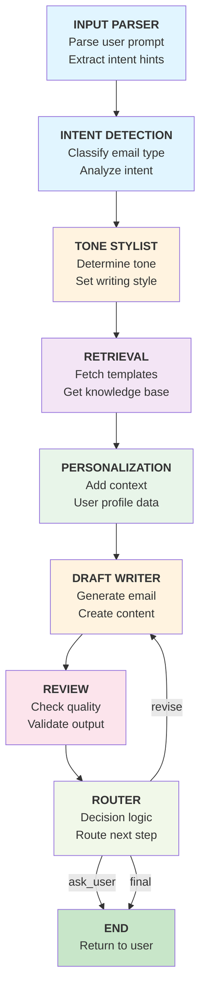

# MailForgeAI Workflow Diagram

## Visual Workflow



## Workflow Description

The MailForgeAI system uses a LangGraph-based workflow that processes email generation through the following stages:

### 1. **Input Parser**
   - Parses the user's natural language prompt
   - Extracts initial intent hints and metadata
   - Prepares structured input for downstream agents

### 2. **Intent Detection**
   - Classifies the email type (e.g., meeting request, apology, follow-up)
   - Analyzes the underlying intent of the message
   - Sets expectations for tone and structure

### 3. **Tone Stylist**
   - Determines the appropriate writing tone (formal, casual, assertive)
   - Applies user preferences and context
   - Sets style guidelines for the draft

### 4. **Retrieval** (RAG Component)
   - Fetches relevant email templates from the knowledge base
   - Retrieves similar past emails for reference
   - Provides domain-specific guidance

### 5. **Personalization**
   - Incorporates user profile information
   - Adds contextual details about the recipient
   - Customizes content for the specific situation

### 6. **Draft Writer**
   - Generates the email content
   - Synthesizes information from all previous stages
   - Creates a complete, ready-to-send draft

### 7. **Review**
   - Validates grammar, clarity, and tone
   - Checks for consistency with user intent
   - Identifies any quality issues

### 8. **Router** (Conditional Decision Node)
   - Makes routing decisions based on review results
   - Three possible outcomes:
     - **revise**: Send back to Draft Writer for improvements
     - **ask_user**: Request clarification from the user
     - **final**: Complete and return the final email

## Graph Characteristics

- **Type**: DAG (Directed Acyclic Graph) with conditional loops
- **Entry Point**: input_parser
- **Exit Points**: END (from router)
- **Max Retries Loop**: Router can send back to draft_writer for revision
- **State Management**: Uses EmailState TypedDict for shared state across agents

## Running the Workflow

```python
from src.workflow.langgraph_flow import GRAPH

# Prepare input state
input_state = {
    "user_id": "user_123",
    "user_prompt": "Send a meeting request to John about Q1 planning",
    "tone_mode": "formal",
    "metadata": {
        "recipient_name": "John",
        "recipient_company": "Acme Corp",
        "relationship": "colleague"
    }
}

# Execute workflow
result = GRAPH.invoke(input_state)
print(result["final_output"])
```
